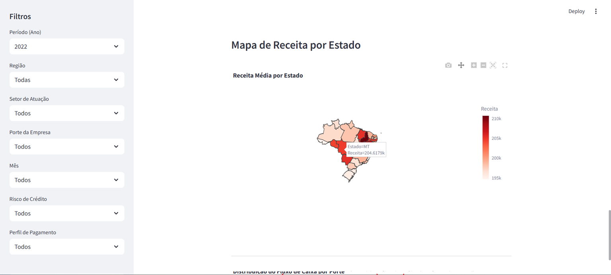

# Painel Estratégico do Cliente PJ - Santander

## Funcionalidades

- Filtros dinâmicos para selecionar período, região, setor, porte da empresa, mês, risco de crédito e perfil de pagamento.
- Indicadores chave (KPIs) de receita média, transações médias, fluxo de caixa médio e número de clientes ativos.
- Gráficos interativos de linha, barra, caixa e mapa geoespacial para análise detalhada.
- Visualização da distribuição regional da receita por estado no Brasil.
- Personalização visual com a paleta de cores e logo do Santander.

## Tecnologias Utilizadas

- Python
- Streamlit
- Plotly Express
- Pandas e Numpy

## Como Rodar

### Pré-requisitos

- Python 3.8 ou superior instalado.

### Instalação das dependências

```bash
pip install streamlit pandas numpy plotly requests pillow
```

#### Execute o comando abaixo na raiz do projeto para iniciar o Streamlit:

```bash
streamlit run nome_do_arquivo.py
```
### Observações

- Os dados utilizados são simulados para fins educacionais e de prototipagem.

- O mapa geoespacial utiliza um arquivo GeoJSON público para desenhar os estados do Brasil.

- Este projeto pode ser adaptado para integrar dados reais do Santander para análises mais profundas.

### Prints Funcionais



